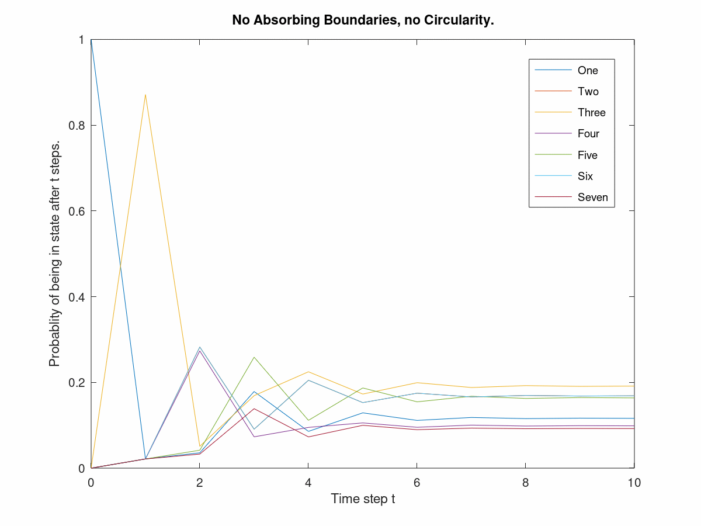

# Undergrad Research and Projects Overview
The purpose of this repository is to host and archive elements of the various projects which I worked on during my studies as an undergraduate. As a general disclaimer a decent amount of the work and code here is relatively unrefined. If you are looking for projects which are more reflective of my current capabilities, I recommend you check out some of my other repositories which host personal projects as well as the work I have done in graduate classes. Thank you for your interest!

## Linear Algebra Project
Originally intended to be presented at KSC Academic Excellence Conference 2020 this project is an exploration of Google's traditional page rank algorithm, the prject was completed with the close oversight of our Linear Algebra professor. Included is an overview of the mathematics behind markov chains and random walks. We demonstrate the effects of markov chains with absorbing boundaries, circulatory boundaries, and chains with neither. Code was produced using matlab, files hosted here are the poster itself as well as the code used to generate the images. 

## Math Modeling and Computing March Madness Project
As part of our 2019 Math Modeling and computing class students at Keene State College were formed into groups to design models which could create brackets, via prediction, for the 2019 NCAA March Madness tournament. The excel file in this repo documents our model and strategy for predicting this tournament, we used a combination of linear probability models and logistic regression to predict the winner of a given game, trained off of data from the NBA regular season. The excel file utilizes, statistics add-ins, look-ups, and macros to organize the prediction results. 

## The Effects of the Minimum Wage Across the New-Hampshire-Massachusetts State Border 
